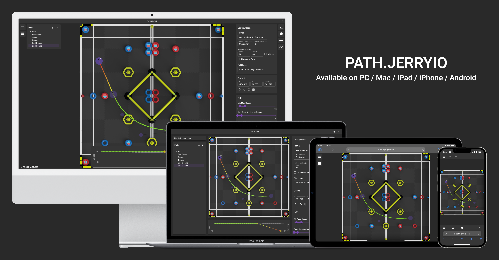
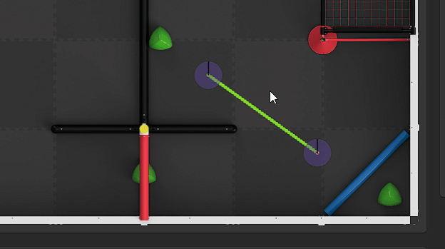
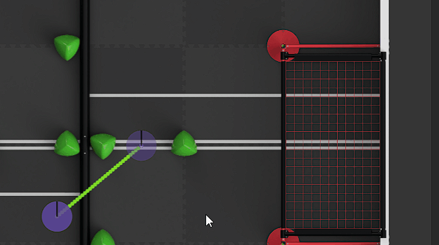
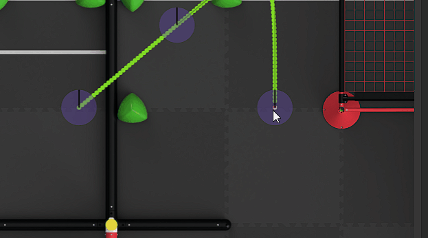

<p align="center">
</p>
<h3 align="center">KUdos Path Planner 2026</h3>
<h4 align="center">The official custom path editor used by our team for designing autonomous routes, managing dual-field layouts, and generating field-ready path files</h4>
<p align="center"><em>Note: Kudos Path Planner is an internal fork derived from the open-source project PATH.JERRYIO. Special thanks to the original authors and contributors for building the foundational architecture.</em></p>

---

## Introduction

Kudos Path Planner is a Progressive Web App (PWA) built specifically for our team's workflow. It is installable and works fully offline across laptops, tablets, and mobile devices in the pit or lab.

It allows our team to design, visualize, and edit autonomous routes using intuitive click-and-drag Bézier curves. The editor exports structured coordinate data $(x, y, \theta)$ directly compatible with our robot's path-following algorithms.



## Dual-Field Support: VEX & RECF

Our fork includes built-in visual overlays and coordinate space mappings for both competition environments:

- **VEX Robotics Competition (VURC):** Pre-configured tile grids, field element markers, and standard field-centric coordinate frames.
- **RECF / Custom Field Layouts:** Dedicated field maps and origin offset configurations tailored for RECF events.

Select your target game field from the **Configuration Panel** to instantly swap field background assets and coordinate grids without breaking existing path waypoints.

## Demonstration

We aim to provide the best environment for path editing and planning within Kudos Path Planner by focusing on delivering a user experience comparable to industry-grade design tools:

### Smooth and User-Friendly

The dragging, panning, and area selection interaction continue even when the cursor is outside the canvas.



### Intuitive and Straightforward

Designed to have a similar editing experience to standard graphic design software. Hold `Shift` to drag multiple controls or enable magnetic snapping.



### Professional and Powerful

Hide or lock entities, undo/redo any changes you make, and manipulate target speed for every waypoint.



## Who It's For

### For Drivers & Strategists
* Design and simulate 1-minute skills driver routes visually.
* Export clean path previews to share match strategies across the team.
* Hide complex speed and code settings in the panel UI for a clean planning surface.

### For Software Developers
* Native support for generating custom field coordinates $(x, y, \theta)$ compatible with our robot software framework.
* Toggle origin offsets and coordinate spaces directly inside the configuration panel.
* Re-open, edit, and convert saved paths seamlessly between iterations.

## Main Features

### Core Functionality
- **Bézier Curves:** Full control over individual curve segment shaping.
- **Waypoints:** Add, delete, split, or reorder path segments with mouse interactions.
- **Drive Types:** Heading and position editing for both Holonomic and Differential drivebases.
- **Speed Profiles:** Keyframe-based acceleration, deceleration, and maximum speed caps.
- **Density Control:** Export evenly-spaced waypoints tailored for custom Pure Pursuit lookahead distances.
- **Offline PWA:** Install locally on laptops or tablets for offline pit/lab use.

### Interface & Controls
- **Shortcuts & Hotkeys:** Zoom-to-cursor (`Ctrl` + Wheel), magnetic snapping, and multi-point selection.
- **Entity Tree:** Lock or hide specific path layers to avoid accidental edits during testing.
- **Theme Support:** Dark and light modes with responsive touch/tablet support.

## Local Setup & Deployment

This repository is hosted via **GitHub Pages** for instant access across all team devices.

To run or test the editor locally via Docker:

```bash
# Run detached container locally
docker compose up -d

# Pull latest team updates and rebuild
git pull
docker compose up -d --build
```

Contributors
Repository Creator: Adriana Lippolis
Team: KUdos Robotics

Attribution & Acknowledgments
Base Software: Derived from PATH.JERRYIO
Media Assets: Interface banner and demonstration GIFs are provided courtesy of PATH.JERRYIO
